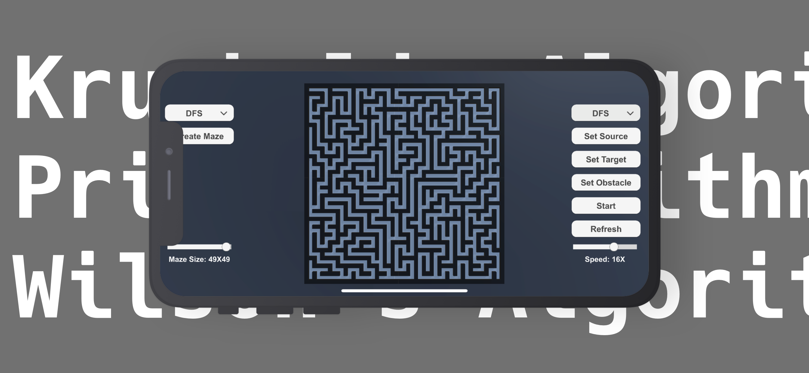
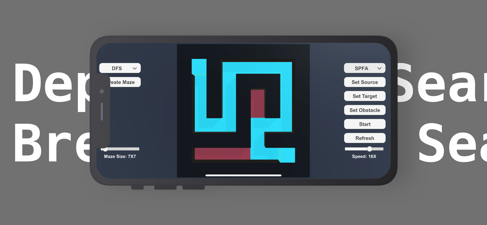

# Graph Algorithm

##### Visualize all kinds of graph algorithms!

- ## Preview

- ## Algorithms

1. Path Finding Algorithms 

- Dijkstra's Algorithm

- Bellman Ford's Algorithm

- SPFA (Shortest Path Faster Algorithm)

2. Graph Searching Algorithms

- BFS (Breadth-First Search)

- DFS ( Depth-first search)

3. Maze Generating Algorithms (Reversed Spanning Tree Algorithms)

- Kruskal's Algorithm

- Prim's Algorithm

- Wilson's Algorithm

- ## Support

  If you have any question, any suggestion about this app, please feel free to contact me at 

  

  Yuting Zhong

  iyuting@terpmail.umd.edu

